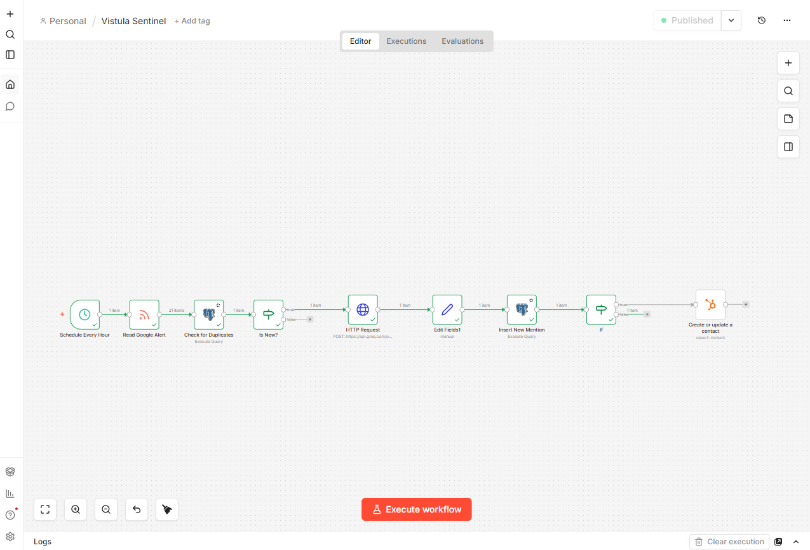

# Sentinel AI: Automated Market Intelligence Pipeline

## Goal
To build an autonomous, cloud-hosted data pipeline that monitors RSS feeds for high-intent business leads, performs AI-driven sentiment analysis, and synchronizes actionable data with a centralized CRM.

## Technical Stack
* Infrastructure: **Ubuntu VM** (Oracle Cloud Infrastructure), **Docker**, **Docker Compose**.
* Automation Engine: **n8n** (Self-hosted via Docker through Nginx Proxy Manager).
* Database: **PostgreSQL**.
* AI/NLP: **Llama 3.3** via Groq API.
* CRM: **HubSpot** (Private App Integration via OAuth Scopes).

## System Architecture
1. Ingestion and Filtering
* Source: Google Alerts RSS / Industry News Feeds.
* Trigger: Cron-scheduled heartbeat (6-hour polling interval).
* Deduplication: SQL-based existence check against external_link to prevent redundant processing.
2. Intelligent Processing
* Parsing: Extraction of unstructured content into structured JSON.
* NLP Tasks:
  * Translation of multilingual headlines to English.
    Sentiment Analysis (Positive/Neutral/Negative).
    Lead Scoring (Intent scale 1-5).
3. Data Persistence
* Schema: Relational model utilizing Foreign Key constraints and ON CONFLICT clauses to ensure data atomicity.
* Logging: RETURNING clauses capture serial primary keys for downstream synchronization.
4. CRM Integration
* Logic: Conditional branching (IF-logic) filters leads with an Intent Score $\ge$ 4
* Mapping: REST API injection of AI analysis into HubSpot Contact objects using unique identifiers.SetupDeploy Postgres and n8n via Docker Compose.Initialize the sentinel_mentions table with a unique constraint on external_link.Import the n8n workflow JSON.Configure environment variables for Groq API and HubSpot Private App Token.Activate the workflow for 24/7 autonomous operation.

## Setup
1. Deploy Postgres and n8n via Docker Compose.
2. Initialize the sentinel_mentions table with a unique constraint on external_link.
3. Import the n8n workflow JSON.
4. Configure environment variables for Groq API and HubSpot Private App Token.
5. Activate the workflow for 24/7 autonomous operation.